# ระบบผู้ช่วยเอกสาร AI (กยศ.) — แผนภาพ Workflow ฉบับละเอียดที่สุดสำหรับ Miro (ภาษาไทย)

> **วิธีนำไปใช้ใน Miro**:
> 1. ในโปรแกรม Miro ให้กดเครื่องหมาย **+** หรือเมนู **Apps** ด้านซ้ายมือ แล้วค้นหาแอป **Mermaid**
> 2. คัดลอกโค้ดในบล็อก `mermaid` ของแต่ละหัวข้อด้านล่าง ไปวางในช่องของ Mermaid ใน Miro
> 3. กด **Generate** Miro จะสร้างแผนภาพให้อัตโนมัติ สามารถย้าย ปรับขนาด หรือเปลี่ยนสีได้ทันที

---

## 1. 🏗️ ภาพรวมสถาปัตยกรรมทั้งระบบ (System Architecture Overview)

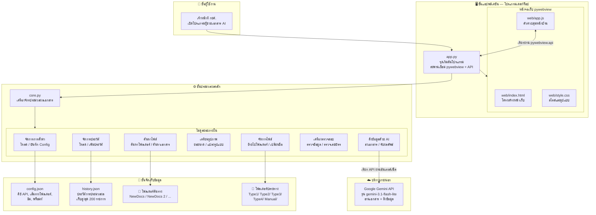

---

## 2. 🚀 ขั้นตอนการเริ่มต้นโปรแกรม (Application Startup Flow)

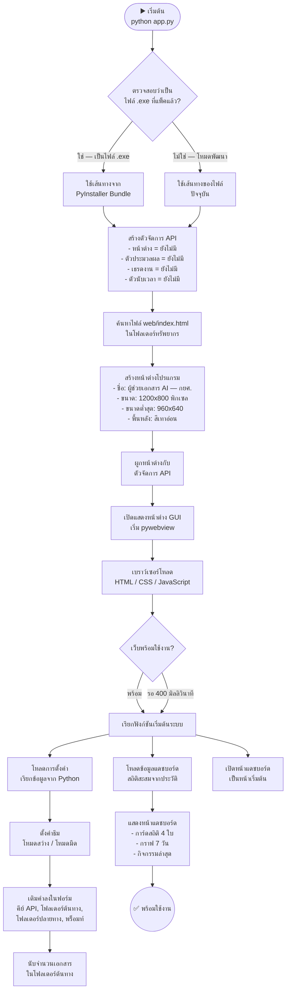

---

## 3. ⚙️ การจัดการการตั้งค่าระบบ (Configuration & Persistence Flow)

```mermaid
flowchart TD
    subgraph LOAD_CONFIG["📖 ขั้นตอนการโหลดการตั้งค่า"]
        L1["เรียกฟังก์ชันโหลดการตั้งค่า"] --> L2["สร้างค่าเริ่มต้น<br/>คีย์ API: ว่าง<br/>โฟลเดอร์ต้นทาง: ว่าง<br/>โฟลเดอร์ปลายทาง: ว่าง<br/>ธีม: สว่าง<br/>พร็อมท์: ว่าง"]
        L2 --> L3{"อ่านไฟล์ config.json<br/>ได้หรือไม่?"}
        L3 -->|"อ่านได้"| L4["รวมค่าจากไฟล์<br/>เข้ากับค่าเริ่มต้น"]
        L3 -->|"อ่านไม่ได้<br/>ไฟล์ไม่มี/เสียหาย"| L5["ใช้ค่าเริ่มต้น"]
        L4 --> L6{"คีย์ API ว่างอยู่?"}
        L5 --> L6
        L6 -->|"ว่าง"| L7["ดึงจากตัวแปรสภาพแวดล้อม<br/>GEMINI_API_KEY"]
        L6 -->|"มีค่าแล้ว"| L8{"พร็อมท์ว่าง?"}
        L7 --> L8
        L8 -->|"ว่าง"| L9["ใช้พร็อมท์เริ่มต้น<br/>ที่ฝังไว้ในโปรแกรม"]
        L8 -->|"มีค่าแล้ว"| L10["✅ ส่งค่าตั้งค่ากลับ"]
        L9 --> L10
    end

    subgraph SAVE_CONFIG["💾 ขั้นตอนการบันทึกการตั้งค่า"]
        S1["เรียกฟังก์ชันบันทึกการตั้งค่า<br/>พร้อมค่าใหม่"] --> S2["โหลดค่าปัจจุบัน"]
        S2 --> S3["รวมเฉพาะ key ที่<br/>อยู่ในรายการที่อนุญาต"]
        S3 --> S4["เขียนไฟล์ config.json<br/>รูปแบบ UTF-8 ย่อหน้า 2 ช่อง"]
        S4 --> S5["✅ ส่งค่าตั้งค่าที่อัพเดทแล้วกลับ"]
    end

    subgraph CONFIG_PATH["📂 ตำแหน่งจัดเก็บไฟล์ตั้งค่า"]
        P1{"ระบบปฏิบัติการ?"}
        P1 -->|"วินโดวส์"| P2["โฟลเดอร์ AppData<br/>ของผู้ใช้วินโดวส์"]
        P1 -->|"แมค"| P3["โฟลเดอร์ Library/<br/>Application Support/"]
        P1 -->|"ลินุกซ์"| P4["โฟลเดอร์ .config/<br/>ของผู้ใช้"]
        P2 --> P5["config.json<br/>history.json"]
        P3 --> P5
        P4 --> P5
    end
```

---

## 4. 📄 ขั้นตอนหลักการประมวลผลเอกสาร (Main Document Processing Flow)

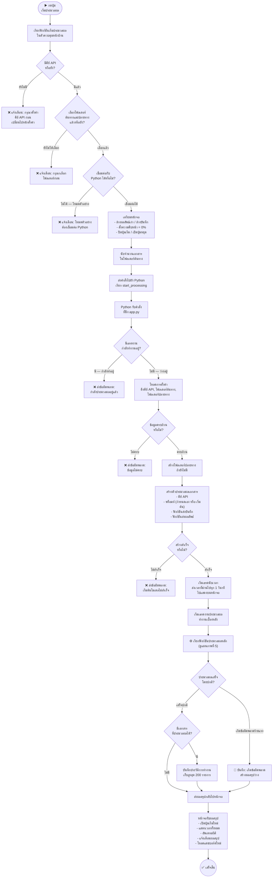

---

## 5. 🔄 ลูปการประมวลผลหลัก (Core Processing Loop)

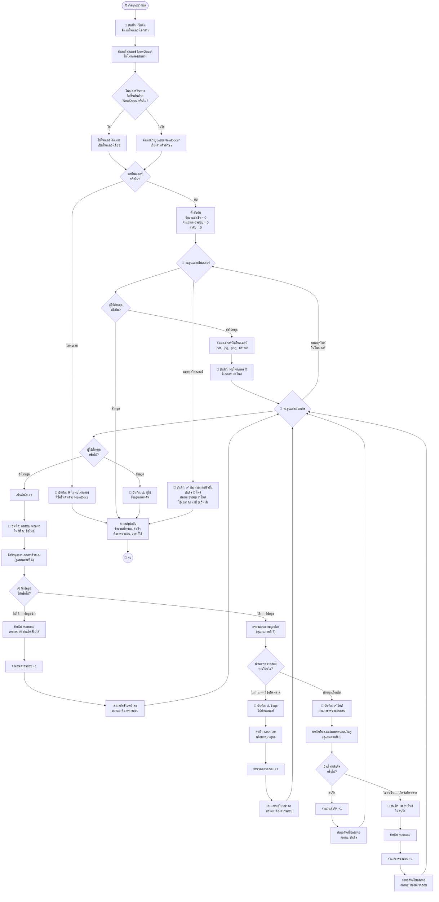

---

## 6. 🤖 กระบวนการส่งเอกสารให้ AI ดึงข้อมูล (AI Data Extraction Pipeline)

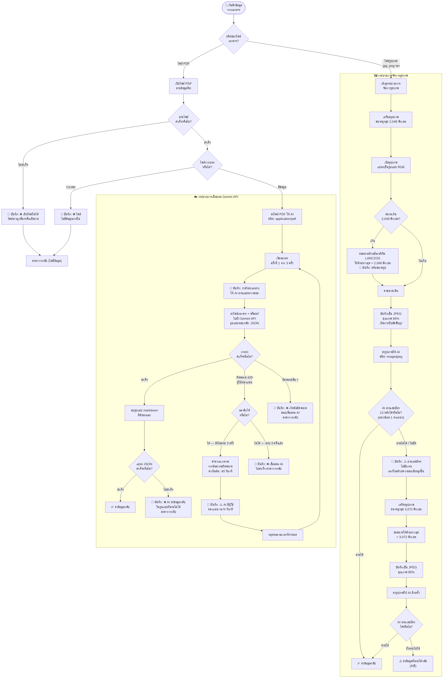

---

## 7. ✅ เงื่อนไขการตรวจสอบความถูกต้อง 4 ด่าน (Validation Logic)

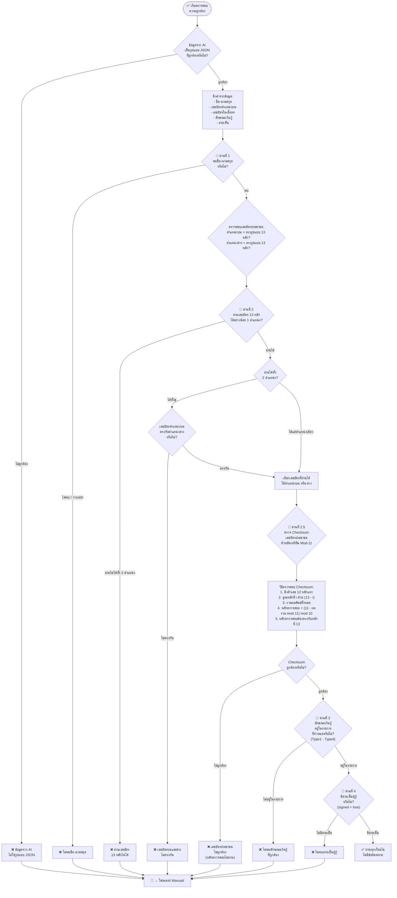

---

## 8. 📁 การย้ายและเปลี่ยนชื่อไฟล์ (File Operations Flow)

```mermaid
flowchart TD
    subgraph MOVE_SUCCESS["✅ ย้ายไฟล์ที่ผ่านการตรวจสอบ"]
        ML1["รับข้อมูล: เส้นทางไฟล์,<br/>โฟลเดอร์ปลายทาง,<br/>ข้อมูลจาก AI"] --> ML2["ดึงเลขบัตรประชาชน<br/>จากข้อมูล AI<br/>(ตำแหน่งบน หรือ ล่าง)"]
        ML2 --> ML3["ดึงลักษณะเงินกู้<br/>เช่น Type1"]
        ML3 --> ML4["หาชื่อโฟลเดอร์ปลายทาง<br/>จากตารางกำหนด<br/>เช่น Type1 → Type1"]
        ML4 --> ML5["สร้างโฟลเดอร์ปลายทาง<br/>ถ้ายังไม่มี"]
        ML5 --> ML6["สร้างชื่อไฟล์ใหม่:<br/>เลขบัตร + นามสกุลไฟล์เดิม<br/>เช่น 1234567890123.pdf"]
        ML6 --> ML7{"ชื่อไฟล์ซ้ำ<br/>ในโฟลเดอร์ปลายทาง?"}
        ML7 -->|"ซ้ำ"| ML8["เติมตัวเลขต่อท้าย<br/>เช่น 1234567890123 (1).pdf<br/>หรือ 1234567890123 (2).pdf"]
        ML7 -->|"ไม่ซ้ำ"| ML9["ใช้ชื่อเดิม"]
        ML8 --> ML10["ย้ายไฟล์ไปปลายทาง"]
        ML9 --> ML10
        ML10 --> ML11["📝 บันทึก: ✅ จัดเก็บเรียบร้อย<br/>โฟลเดอร์ Type1<br/>ชื่อ 1234567890123.pdf"]
    end

    subgraph MOVE_MANUAL["⚠️ ย้ายไฟล์ที่ต้องตรวจสอบด้วยตนเอง"]
        MM1["รับข้อมูล: เส้นทางไฟล์,<br/>โฟลเดอร์ปลายทาง,<br/>เหตุผล"] --> MM2["สร้างโฟลเดอร์ Manual/<br/>ถ้ายังไม่มี"]
        MM2 --> MM3{"ชื่อไฟล์ซ้ำ<br/>ใน Manual/?"}
        MM3 -->|"ซ้ำ"| MM4["เติมตัวเลขต่อท้าย<br/>(1), (2), ..."]
        MM3 -->|"ไม่ซ้ำ"| MM5["ใช้ชื่อเดิม"]
        MM4 --> MM6["ย้ายไฟล์ไป Manual/"]
        MM5 --> MM6
        MM6 --> MM7["📝 บันทึก: ⚠️ ย้ายไฟล์ไป<br/>โฟลเดอร์ตรวจสอบด้วยตนเอง<br/>เนื่องจาก: ระบุเหตุผล"]
    end

    subgraph OUT_STRUCT["📂 โครงสร้างโฟลเดอร์ปลายทาง"]
        OUT["โฟลเดอร์ปลายทาง/"]
        OUT --> T1["📁 Type1/<br/>เอกสารลักษณะที่ 1"]
        OUT --> T2["📁 Type2/<br/>เอกสารลักษณะที่ 2"]
        OUT --> T3["📁 Type3/<br/>เอกสารลักษณะที่ 3"]
        OUT --> T4["📁 Type4/<br/>เอกสารลักษณะที่ 4"]
        OUT --> MAN["📁 Manual/<br/>เอกสารที่ต้องตรวจสอบ"]
        T1 --> F1["1234567890123.pdf"]
        T1 --> F2["9876543210987.pdf"]
        T1 --> F3["1234567890123 (1).pdf"]
        MAN --> FM1["เอกสารอ่านไม่ได้.pdf"]
        MAN --> FM2["เอกสารไม่มีลายเซ็น.jpg"]
    end
```

---

## 9. 🔗 การสื่อสารระหว่างหน้าบ้านและหลังบ้าน (Frontend-Backend Communication)

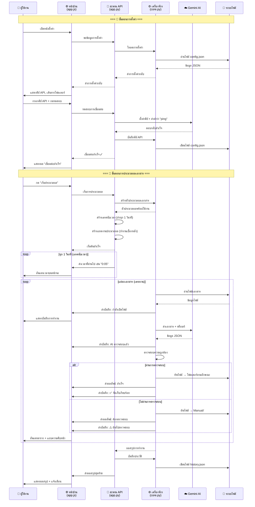

---

## 10. 📊 โครงสร้างข้อมูลที่ AI ดึงจากเอกสาร (Gemini Prompt & AI Response Structure)

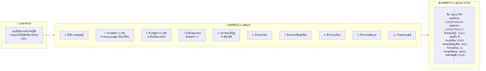

---

## 11. 🖥️ หน้าจอและการนำทาง (UI Pages & Navigation Flow)

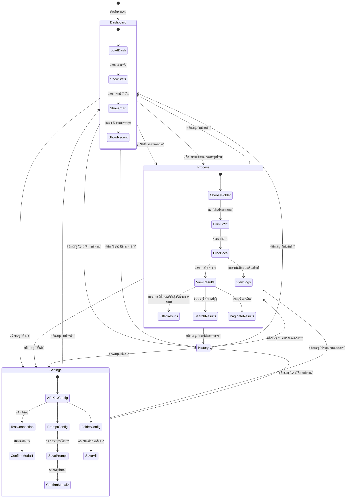

---

## 12. 🔐 ระบบยืนยันความปลอดภัย (Security & Confirmation Flow)

```mermaid
flowchart TD
    subgraph CONFIRM_FLOW["🔐 กระบวนการยืนยันก่อนเปลี่ยนแปลง"]
        CF1["ผู้ใช้เปลี่ยนค่าสำคัญ<br/>(คีย์ API หรือ พร็อมท์)"] --> CF2["เปิดหน้าต่างยืนยัน<br/>แสดงหัวข้อ + คำอธิบาย"]
        CF2 --> CF3["แสดงคำที่ต้องพิมพ์<br/>เช่น 'confirm change api'<br/>หรือ 'confirm change prompt'"]
        CF3 --> CF4["ผู้ใช้พิมพ์คำยืนยัน"]
        CF4 --> CF5{"พิมพ์ตรงกับ<br/>คำที่กำหนด?"}
        CF5 -->|"ตรง"| CF6["ปุ่ม 'ยืนยัน' เปิดให้กดได้"]
        CF5 -->|"ไม่ตรง"| CF7["ปุ่ม 'ยืนยัน' ยังกดไม่ได้"]
        CF7 --> CF4
        CF6 --> CF8{"ผู้ใช้เลือก?"}
        CF8 -->|"กดยืนยัน"| CF9["✅ ดำเนินการเปลี่ยนแปลง"]
        CF8 -->|"กดยกเลิก / กด ESC"| CF10["❌ ยกเลิก ไม่เปลี่ยนแปลง"]
    end

    subgraph API_KEY_CHANGE["🔑 ขั้นตอนเปลี่ยนคีย์ API"]
        AK1["กรอกคีย์ API ใหม่"] --> AK2{"คีย์เปลี่ยนจาก<br/>ค่าเดิมหรือไม่?"}
        AK2 -->|"เปลี่ยน"| AK3["เปิดหน้าต่างยืนยัน<br/>พิมพ์ 'confirm change api'"]
        AK2 -->|"ไม่เปลี่ยน"| AK4["บันทึกโดยไม่ต้องถาม"]
        AK3 --> AK5{"ยืนยัน?"}
        AK5 -->|"ยืนยัน"| AK6["บันทึกการตั้งค่า<br/>แจ้ง: บันทึกเรียบร้อย"]
        AK5 -->|"ยกเลิก"| AK7["แจ้ง: ยกเลิกแล้ว"]
    end

    subgraph PROMPT_CHANGE["📝 ขั้นตอนเปลี่ยนพร็อมท์"]
        PC1["แก้ไขข้อความพร็อมท์"] --> PC2{"พร็อมท์เปลี่ยน<br/>จากค่าเดิมหรือไม่?"}
        PC2 -->|"เปลี่ยน"| PC3["เปิดหน้าต่างยืนยัน<br/>พิมพ์ 'confirm change prompt'"]
        PC2 -->|"ไม่เปลี่ยน"| PC4["แจ้ง: ยังไม่มีการเปลี่ยนแปลง"]
        PC3 --> PC5{"ยืนยัน?"}
        PC5 -->|"ยืนยัน"| PC6["บันทึกการตั้งค่า<br/>แจ้ง: บันทึกเรียบร้อย"]
        PC5 -->|"ยกเลิก"| PC7["แจ้ง: ยกเลิกแล้ว"]
    end

    subgraph API_KEY_CLEAN["🧹 การทำความสะอาดคีย์ API"]
        AC1["ผู้ใช้คัดลอกวางคีย์ API"] --> AC2["เริ่มทำความสะอาด"]
        AC2 --> AC3["1. ลบอักขระที่มองไม่เห็น<br/>(ช่องว่างความกว้างศูนย์)"]
        AC3 --> AC4["2. ตัดช่องว่าง<br/>หน้า-หลังออก"]
        AC4 --> AC5["3. ลบเครื่องหมายคำพูด<br/>ที่ครอบอยู่ (' หรือ \")"]
        AC5 --> AC6["✅ คีย์ API ที่สะอาดพร้อมใช้"]
    end
```

---

## 13. 🔄 การอัพเดทข้อมูลแบบเรียลไทม์ (Real-time Update Flow)

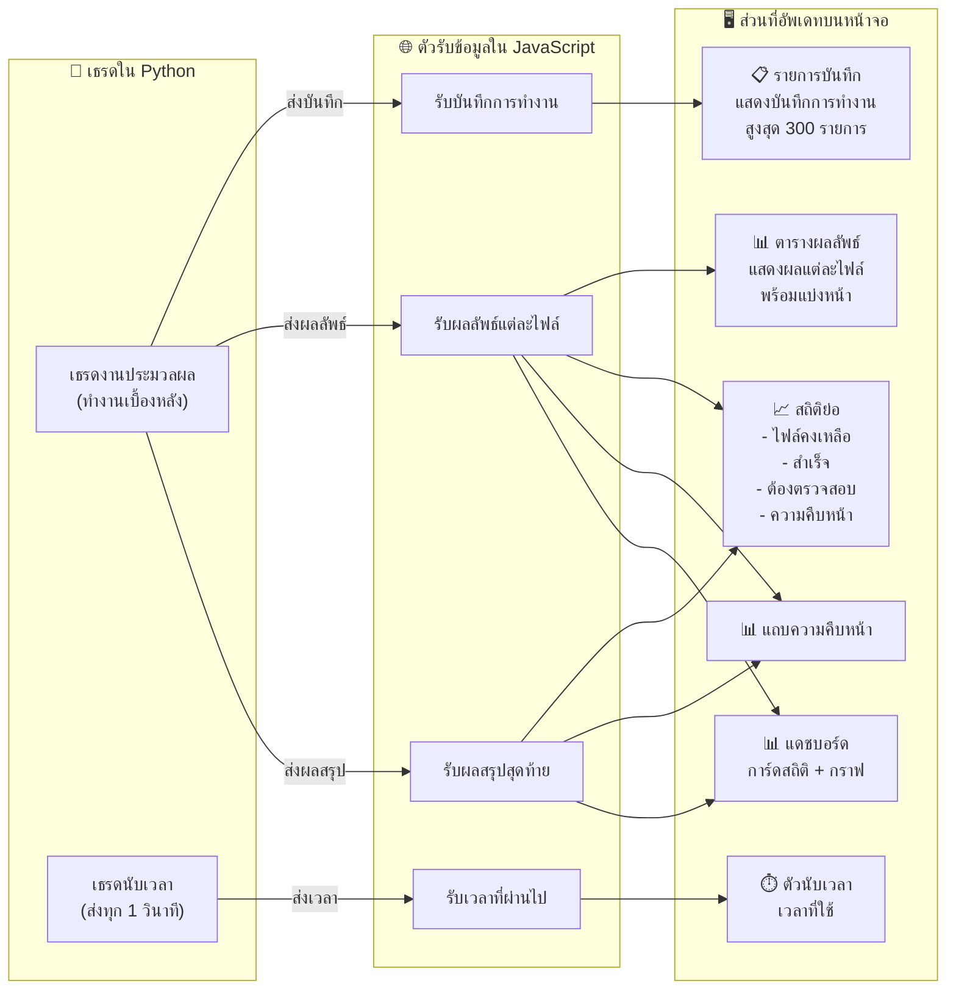

---

## 14. 📦 การสร้างและแจกจ่ายโปรแกรม (Build & Deployment Flow)

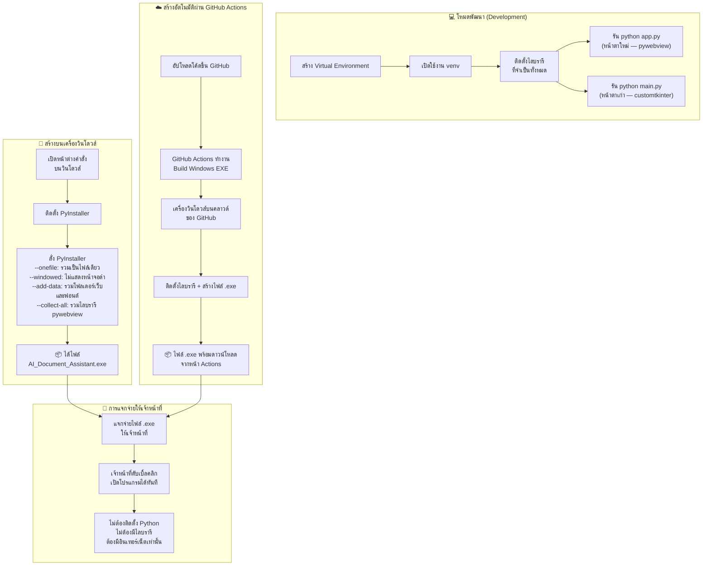

---

## 15. 📋 สรุปการไหลของข้อมูลทั้งระบบ (Complete Data Flow Summary)

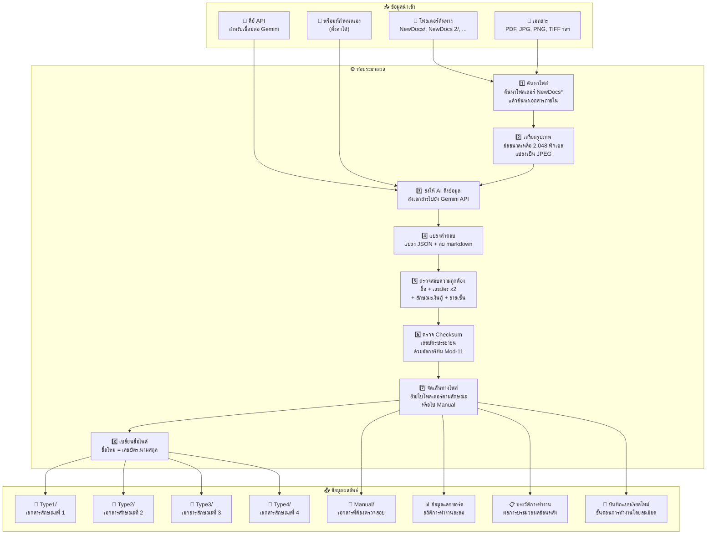

---

## 16. ⚠️ การจัดการข้อผิดพลาดทุกกรณี (Error Handling & Edge Cases)

```mermaid
flowchart TD
    subgraph ERRORS["⚠️ สถานการณ์ข้อผิดพลาดทั้งหมด และวิธีจัดการ"]
        direction TB
        
        E1["❌ ไม่มีคีย์ API"] --> H1["แจ้งเตือน: กรุณาตั้งค่าคีย์ API<br/>เปลี่ยนไปหน้าตั้งค่าอัตโนมัติ"]
        
        E2["❌ โฟลเดอร์ต้นทาง<br/>ไม่ถูกต้อง"] --> H2["ส่งข้อผิดพลาด:<br/>โฟลเดอร์ต้นทางไม่ถูกต้อง"]
        
        E3["❌ ไม่พบโฟลเดอร์<br/>NewDocs*"] --> H3["บันทึก: ไม่พบโฟลเดอร์<br/>เอกสารใหม่ในโฟลเดอร์ที่เลือก"]
        
        E4["❌ เปิดไฟล์ไม่ได้<br/>(ถูกล็อก / เสียหาย)"] --> H4["บันทึก: เปิดไฟล์ไม่ได้<br/>→ ย้ายไปโฟลเดอร์ Manual/"]
        
        E5["❌ ไฟล์ว่างเปล่า<br/>ไม่มีข้อมูลภายใน"] --> H5["บันทึก: ไฟล์ไม่มีข้อมูล<br/>→ ย้ายไปโฟลเดอร์ Manual/"]
        
        E6["❌ AI อ่านเอกสาร<br/>ไม่ได้"] --> H6["บันทึก: AI อ่านไม่ได้<br/>→ ย้ายไปโฟลเดอร์ Manual/"]
        
        E7["❌ คำตอบจาก AI<br/>ไม่ใช่ JSON ที่ถูกต้อง"] --> H7["บันทึก: ข้อมูล AI อ่านไม่ได้<br/>→ ย้ายไปโฟลเดอร์ Manual/"]
        
        E8["❌ ผู้ใช้หนาแน่น (429)<br/>ส่งคำขอเกินโควต้า"] --> H8["รอตามเวลาที่กำหนด<br/>ลองส่งใหม่สูงสุด 3 ครั้ง"]
        
        E9["❌ รูปภาพอ่านเลขบัตร<br/>ไม่ชัดเจน"] --> H9["ลองใหม่ด้วยความละเอียด<br/>3,072 พิกเซล (สูงขึ้น)"]
        
        E10["❌ ข้อมูลไม่ผ่าน<br/>การตรวจสอบ 4 ด่าน"] --> H10["บันทึก: ข้อมูลไม่ผ่านเกณฑ์<br/>→ ย้ายไป Manual/<br/>พร้อมระบุเหตุผลที่ไม่ผ่าน"]
        
        E11["❌ ย้ายไฟล์ไม่สำเร็จ<br/>(ไม่มีสิทธิ์ / ดิสก์เต็ม)"] --> H11["บันทึก: ย้ายไฟล์ไม่ได้<br/>→ ย้ายไป Manual/ แทน"]
        
        E12["❌ ผู้ใช้กดหยุด<br/>ระหว่างประมวลผล"] --> H12["บันทึก: ผู้ใช้สั่งหยุด<br/>จบการทำงานหลังไฟล์<br/>ปัจจุบันเสร็จ"]
        
        E13["❌ เกิดข้อผิดพลาดร้ายแรง<br/>ระหว่างประมวลผล"] --> H13["บันทึก: ระบบหยุดทำงาน<br/>กะทันหัน<br/>ส่งผลสรุปว่างกลับ"]
        
        E14["❌ ชื่อไฟล์ปลายทาง<br/>ซ้ำกัน"] --> H14["เติมตัวเลขต่อท้าย (1), (2), ...<br/>ไม่มีการทับไฟล์เดิม"]
    end
```
